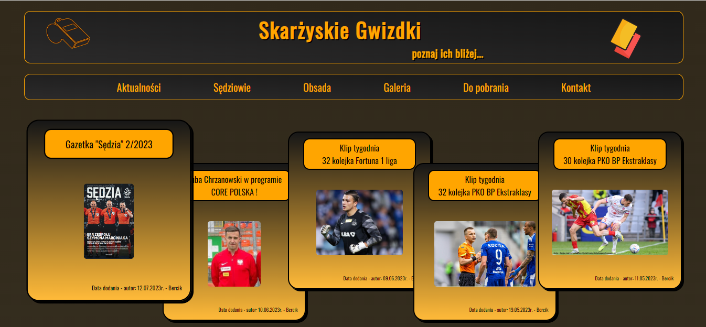
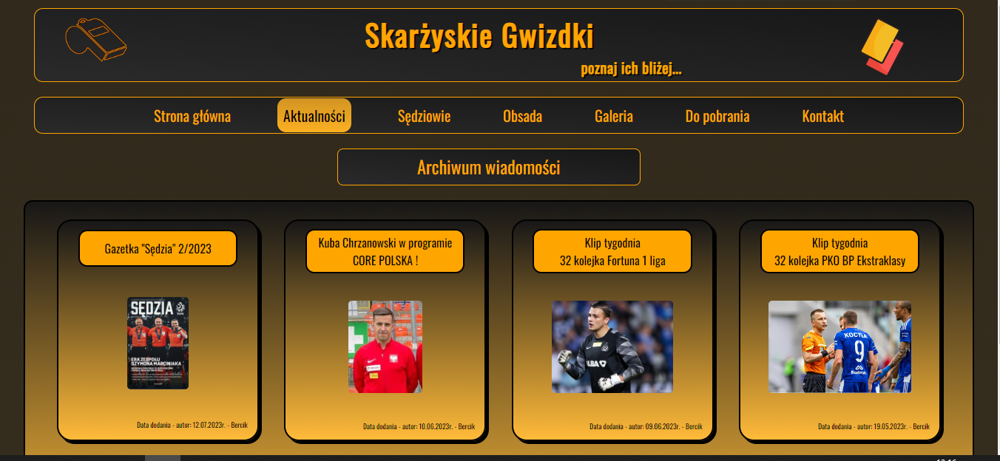
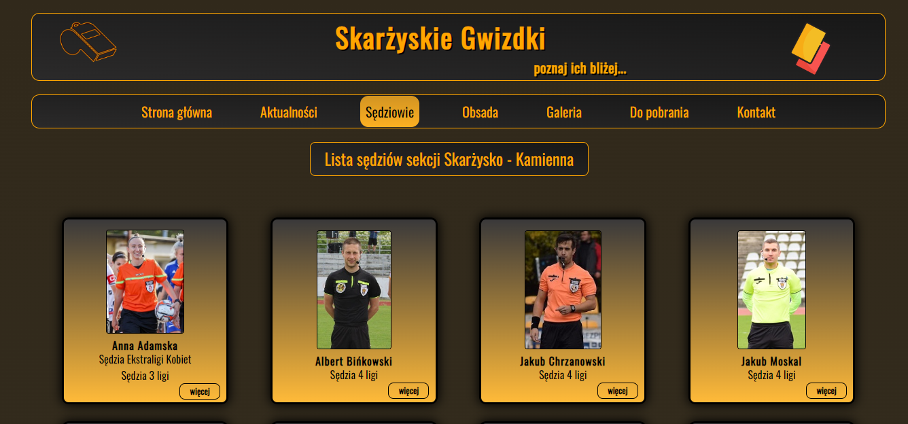
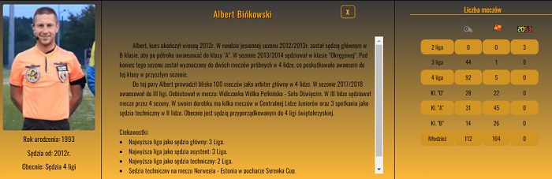

# The page about referees from Skarżysko - Kamienna   
## www.skarzyskiegwizdki.pl 

# Content of project
* [General info](#general-info)
* [Technologies](#technologies)
* [Installation](#installation)
* [Application view](#application-view)
* [History about project](#history-about-project)
* [To update](#to-update)
* [Tutorials](#tutorials)
* [Summary of the project](#summary-of-the-project)
* [Contact](#contact)

## General info

Click here to see general information about <b>Project</b>!

This page is about the referees from Skarżysko - Kamienna. In this page you can find more information about refeeres from Skarżysko
( <b> subpage: Sędziowie </b>). You can find out, where people of our section will be "whistle" on the week (<b> subpage: Obsada </b>).

## Technologies
<ul>
<li>PHP</li>
<li>HTML</li>
<li>JAVASCRIPT</li>
<li>CSS</li>
<li>SCSS</li>
</ul>

## Installation
You have just click: www.skarzyskiegwizdki.pl

## Application view

 <b>home</b> 

  This image shows home page. This page contains header, menu and five articles, which are newest on this page.  

 

 <b>referees page </b> 

  This images shows all active refeeres in our referee section.  

 
 If you click on photo, you will be able to see more information about every of us.  

## History about project

## To update

## Tutorials

## Summary of the project

## Contact
