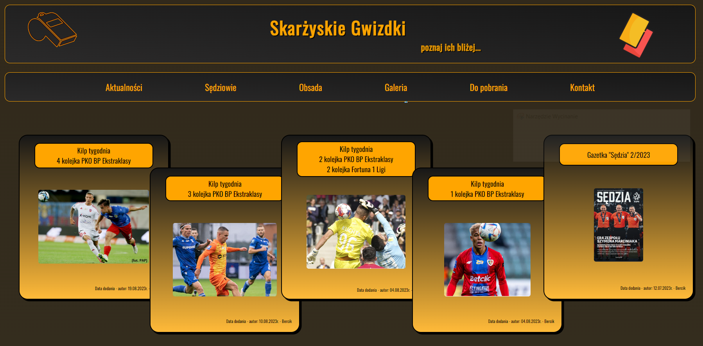
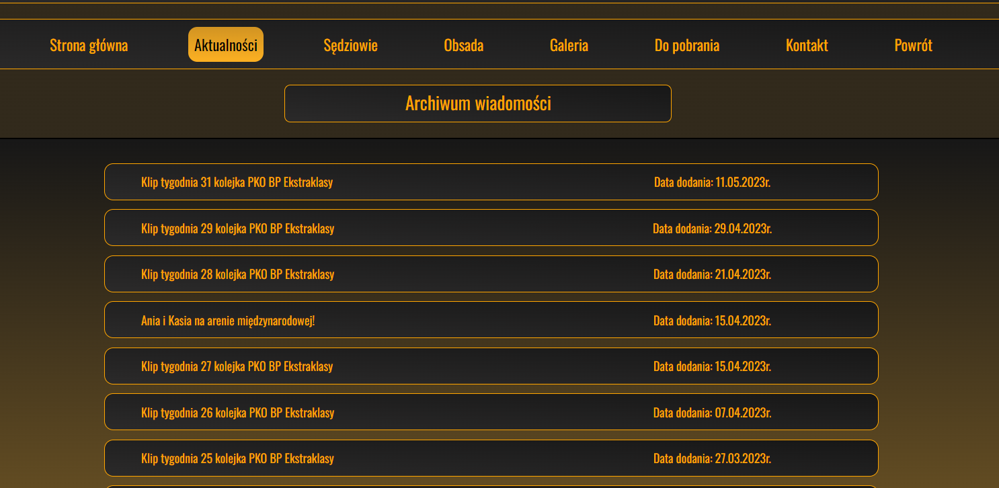
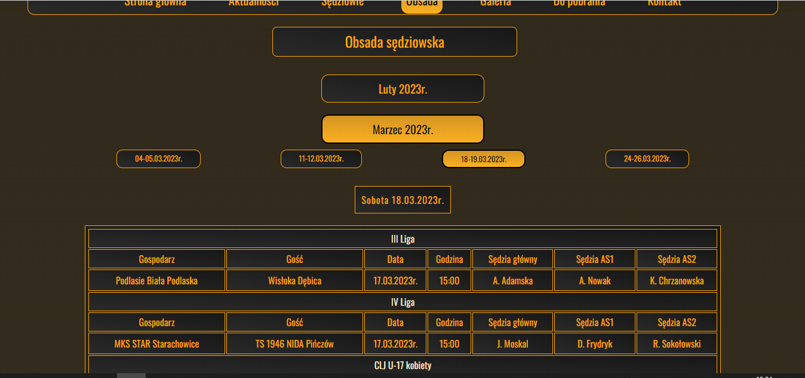
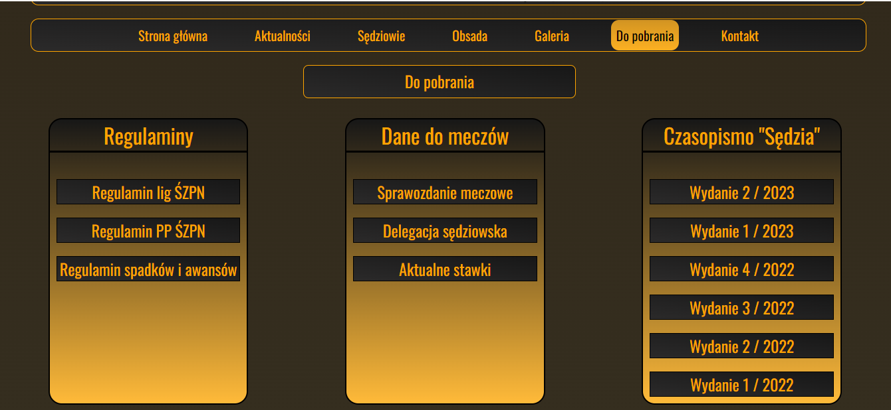
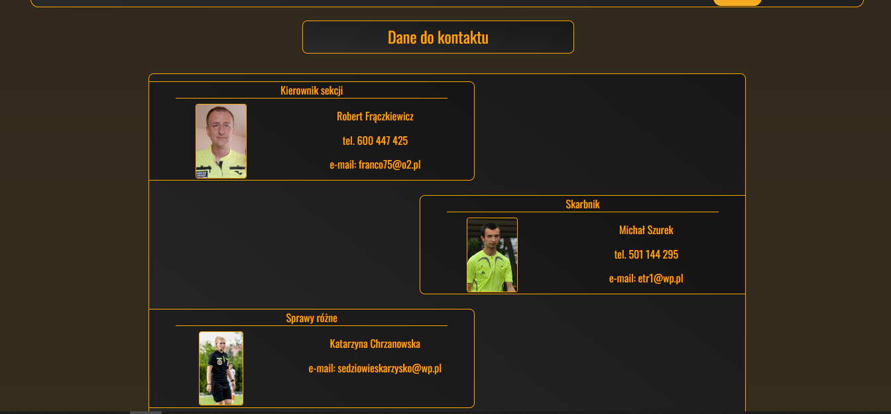
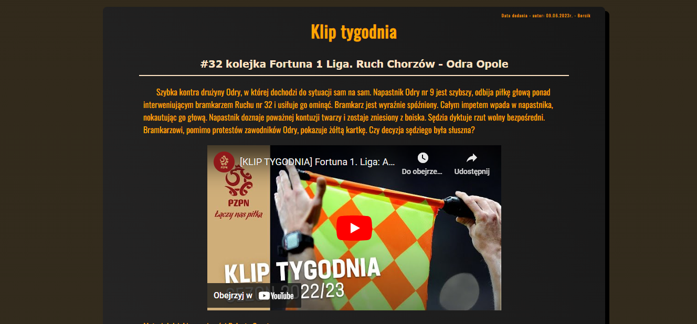

# The page about referees from Skarżysko - Kamienna  

## www.skarzyskiegwizdki.pl

# Content of project

- [General info](#general-info)
- [Technologies](#technologies)
- [Installation](#installation)
- [Application view](#application-view)
- [To update](#to-update)
- [Tutorials](#tutorials)
- [Summary of the project](#summary-of-the-project)
- [Contact](#contact)

## General info

This page is about the referees from Skarżysko - Kamienna. In this page you can find more information about refeeres from Skarżysko
( <b> subpage: Sędziowie </b>). You can find out, where people of our section will be "whistle" on the week (<b> subpage: Obsada </b>).
You can see referres in action on the pitch (<b> subpage: Galeria </b>). Oldest news you can find in the <b> subapage: "Aktualności". </b> Necessary documents for the match, regulations and magazine "Sędzia"
you can find out in the <b> subapage: "Do pobrania". </b> If you want get more information, you should click in the <b> subapage: "Kontakty". </b>

## Technologies

<ul>
<li>PHP</li>
<li>HTML</li>
<li>JAVASCRIPT</li>
<li>CSS</li>
<li>SCSS</li>
</ul>

## Installation

You have just click: www.skarzyskiegwizdki.pl

## Application view

 <b>home</b> 

  This image shows home page. This page contains header, menu and five articles, which are newest on this page.  

 

 <b>referees page </b> 

  This images shows all active refeeres in our referee section.  

 
 If you click on photo, you will be able to see more information about every of us.  

 <b>news</b> 

  This image shows the news page. On this page you can read all the news since the creation of the site. 
 

 <b>cast</b> 

  This page contains the cast on the actually round of season.   

 <b>gallery</b> 

  On this page you can see our photos from matches   

 <b>to Download</b> 

  This subpage conatins important files for the refeeres.  

 <b>contact</b> 

  This subpage shows contact to us.  

 <b>Simple news</b> 

  This photo shows view from some news in the page.  

## To update

In the future I want to add subpage about history of the our referees section. This is my first page so I know that code isn't pure.
I have to do code review once again. Some function in file for "cast" should be fixed. The code in this file is repeat, what is wrong practice.
I think that counter of vistit on the page doesn't work 100 percent right.

## Tutorials

To create this page I used a dozen tutorials. A few from of them are below:

<ul>
<li>https://www.youtube.com/watch?v=n-cW9HzpnRk&t=3449s</li>
<li>https://www.youtube.com/watch?v=YpB1I3wgDgQ</li>
<li>https://www.youtube.com/watch?v=L19WO4jfzMM&t=1020s</li>
<li>https://www.youtube.com/watch?v=HaDYXVqbJcw&t=2s</li>
<li>https://www.youtube.com/watch?v=q0KJEmMlG20&t=236s</li>
<li>https://www.youtube.com/watch?v=o_GnXwio5Hs</li>
</ul>

## Summary of the project

This is my first page. This page is for everyone not only for referees. This page was created from white window to version, which you can see now.
This is my another hobby so I create it only when I was free time. Except my professional work, I'm referee so this hobby takes me a lot of time also.
I want to develop my skills in practice so I thought it will be great combination of developing my skills and my hobby.

## Contact

<ul>
<li> My github: https://github.com/AlbertB93 </li>
<li>E-mail to me:  bercik93@interia.eu </li>
</ul>
